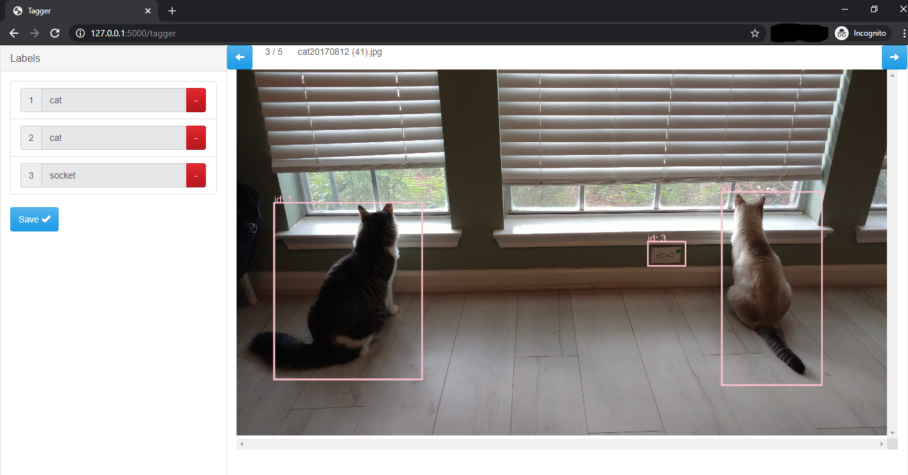

# Simple Image Annotator

## Updates

This version has added the following functionalities:

* Move back to previous images: once moved back, saved labels will overlay on the same image
  * Labels can be changed for any images. Latest outputs will be saved in the `.csv` file.
* Click "Save" to saved labels
* Allow users to change label name after a bounding box has been drawn (just move your cursor to the input box, click, and its background will change white, make editing possible)
* When given a folder path, only show images within that folder. Currently supported file extensions: `.png, .jpg, .gif, .jpeg`
* Filename is shown on the top status bar.

TODO:
* ~~Automatically saved labels if users forget to click "Save" but click "next" instead~~
  * This functionality, once implemented, will mess up with the "load saved labels" function. Also, users are expected to explicitly click "save" to save their changes. Otherwise, labels will not be saved by blindly clicking "next" (it is believed that users have no intention to save too).
* ~~Ability to keep the same bounding box but change label texts~~
* Allow users to upload image(s) for labeling
* Possibly integration with database for persistence

## Known issues

* If you've already saved your labels and would like to continue in a new session, by default your saved labels for the first image won't show. Click the next button and move back, and the labels will render.

## Description
All image annotators I found either didn't work or had some overhead in the setup. So, I tried to make this one simple to run and simple to use.


## Install
* Install Flask
```
$ pip install Flask
```

## Getting started
* cd into this directory after cloning the repo
* Start the app
```
$ python app.py /images/directory
```
* You can also specify the file you would like the annotations output to (out.csv is the default)
```
$ python app.py /images/directory --out test.csv
```
* Open http://127.0.0.1:5000/tagger in your browser
    * Only tested on Chrome

## Output
* In keeping with simplicity, the output is to a csv file with the following fields
    * *id* - id of the bounding box within the image
    * *name* - name of the bounding box within the image
    * *image* - image the bounding box is associated with
    * *xMin* - min x value of the bounding box
    * *xMax* - max x value of the bounding box
    * *yMin* - min y value of the bounding box
    * *yMax* - max y value of the bounding box

## HOWTOs
* Draw a bounding box
  * Click on the image in the location of the first corner of the bounding box you would like to add
  * Click again for the second corner (ideally the entirely opposite direction - say the first corner is top left, the second corner should be bottom right) and the box will be drawn
* Add a label for a box
  * For the box you would like to give a label, find its id (noted in the top left corner of the box)
  * Find the label with the corresponding number
  * Enter the name you want in the input field
  * Press enter
* Change the label for a box
  * For the box you would like to change its label, find its id (noted in the top left corner of the box)
  * Click the input field next to it (background color should change from light grey to white)
  * Enter new label name and press enter
* Save labels
  * Once you're done with labeling the whole image, click the "Save" button. **Note: changes will not saved if you don't click that button!**
* Move to the next image
  * Click the blue right arrow button at the top of the page
* Move to the previous image
  * Click the blue left arrow button at the top of the page
* Remove label
  * Click the red button on the label you would like to remove
  * **Click "Save"**, or changes will not write to the output csv file.
* Check generated data
  * At the top level of the directory where the program was run, there should be a file called `out.csv` that contains the generate data
